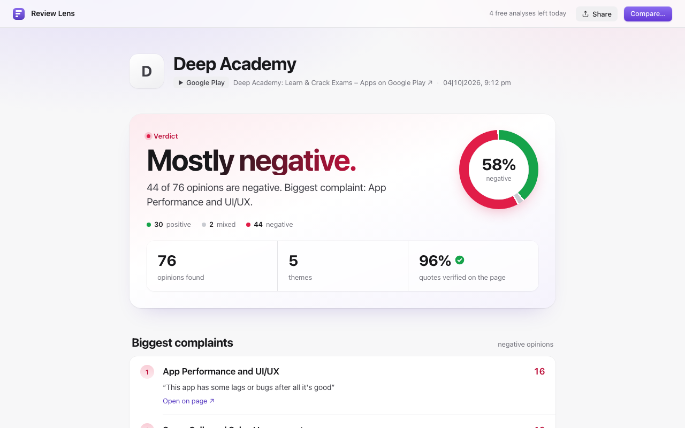
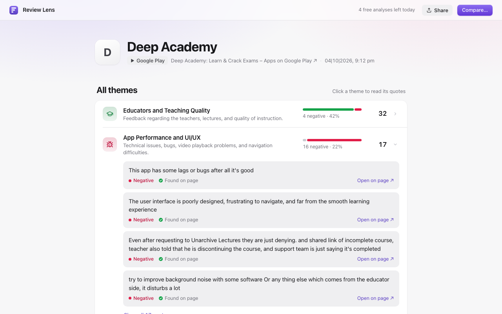
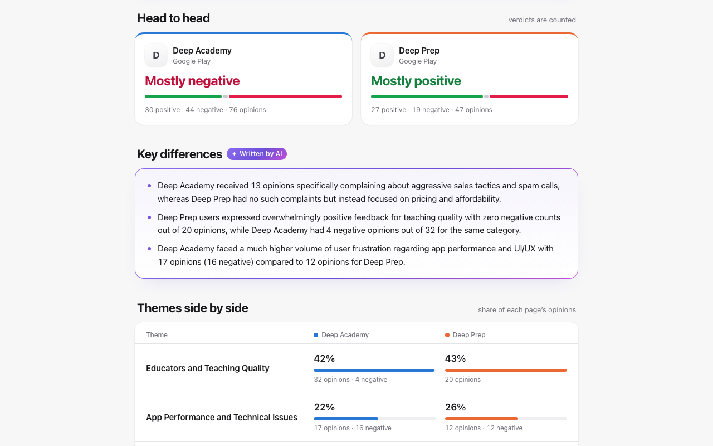
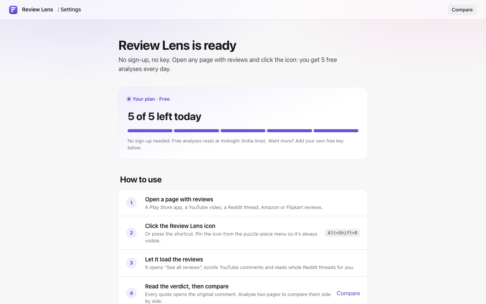
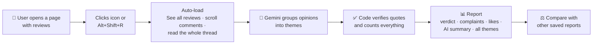
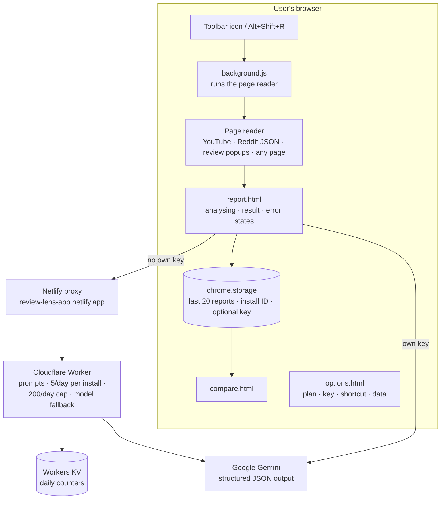
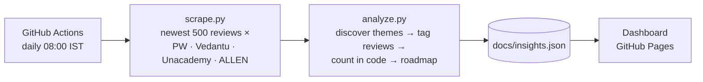
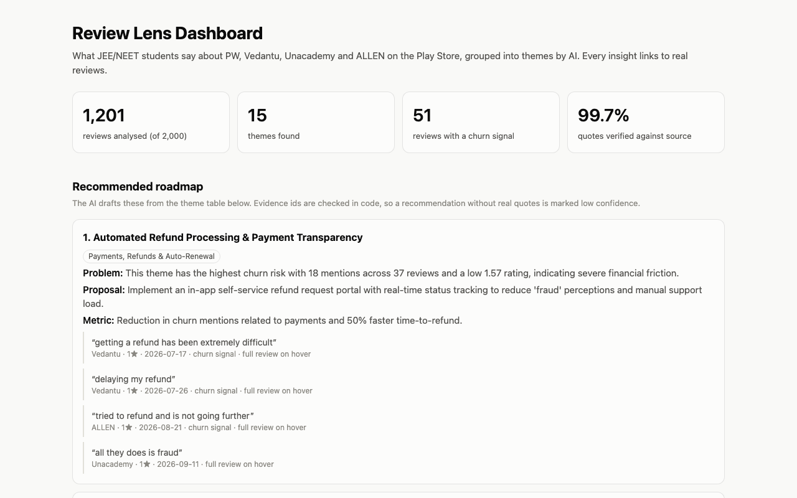

<div align="center">


# Review Lens

**Read hundreds of reviews in 30 seconds. Every quote is proven real.**

A Chrome extension that turns the reviews and comments on any page into a clear verdict, specific themes and verified quotes. You can compare two products side by side. It also ships with a live dashboard that tracks what JEE/NEET students say about India's biggest edtech apps.


</div>

<p align="center">
  
  
</p>
<p align="center">
  
  
</p>
<p align="center"><sub>Verdict → Themes with proof → Compare two apps → One-minute setup (screens shown with demo data; "Deep Academy" and "Deep Prep" are sample names)</sub></p>

---

## The problem

When you're choosing a coaching app, a course or a phone, the real answer is buried in hundreds of reviews. Most people read the top five and guess. Product teams have the same problem with their own app: feedback is spread across Play Store reviews, YouTube comments and Reddit threads, and reading it all takes hours.

AI summaries help, but they bring a new problem: **you can't tell if the AI made something up.** A summary that says "users hate the refund process" is worthless if nobody actually said that.

## The solution

Review Lens reads the page you're on and gives you an answer you can trust:

1. **A verdict that's counted, not generated.** "Mostly negative. 44 of 76 opinions are negative." The AI groups the opinions, and code does the counting.
2. **Specific themes.** "Refund takes weeks", not "bad service", with a positive/mixed/negative split for each.
3. **Proof on every quote.** Every quote is checked against the page text. If the AI invents one, it's dropped, and "Open on page" scrolls to the original comment and highlights it.
4. **Compare.** Line up two to four apps or products, theme by theme, as a share of each page's opinions.

No sign-up and no API key: everyone gets 5 free analyses a day.

## How it works



## Features

| | Feature | What it does |
|---|---|---|
| ⚖️ | **Counted verdict** | "Mostly negative / positive / mixed" decided by the majority of verified opinions, with a donut and exact counts. |
| 🧩 | **Specific themes** | 4 to 10 actionable themes per page, each with a sentiment bar, share of opinions and expandable quotes. |
| ✅ | **Verified quotes** | Every quote must appear on the page word for word, or it's dropped. The report shows how many were verified (e.g. 96%). |
| 🔗 | **Open on page** | Each quote links back to the source page, scrolled to that comment and highlighted (Chrome text fragments). |
| 🔄 | **Auto-loads reviews** | Opens the full review list, scrolls to load more comments, and reads whole threads through their data feed, before analysing. |
| ⚖️ | **Compare 2-4 pages** | Head-to-head verdicts, AI-written key differences, and theme shares side by side, with clear leaders highlighted. |
| ✨ | **AI summary, labelled** | 3-5 bullets marked "Written by AI", kept separate from the counted numbers. |
| 🎁 | **Free tier, no sign-up** | 5 analyses per install per day through a hosted server. Power users can add their own free Gemini key for unlimited use. |
| 🌗 | **Light and dark** | Follows the system theme, works at phone width, keyboard accessible. |
| 📋 | **Copy as text** | One click copies the report for WhatsApp, a doc or an email. |

## Product approach

Review Lens was built solo, from a portfolio idea to a product submitted to the Chrome Web Store.

- **Started narrow, then generalised.** Version one was a Python pipeline and dashboard for one question: what do JEE/NEET students complain about in edtech apps? That validated the method on 2,000 real reviews. The extension then brought the same method to any page.
- **Trust is the product.** The biggest risk with AI summaries is invented evidence. Every design decision protects that trust: counting in code, verifying quotes, labelling AI text, and "Open on page" links.
- **Activation over purity.** The first version asked users for their own API key. That's a big drop-off point for non-technical users, so the free hosted tier became the default and the own key became optional.
- **Fix what real users hit.** College Wi-Fi blocked the server's domain, so a forwarding proxy went in front of it. YouTube and Reddit comments weren't being read, so site-specific readers were added. A store rejection for listing brand names led to a cleaner description.

### Decisions log

| Decision | Why | Trade-off |
|---|---|---|
| Counts in code, never by the AI | LLMs miscount and invent numbers | The AI only labels; code does the maths |
| Quote must be an exact substring of the page | Catches hallucinated evidence automatically | Paraphrased but real points get dropped (2-4% on long pages) |
| Numbered-comment labelling for YouTube/Reddit | Copying quotes made the model return only 5 of 497 comments | Quotes are the full comment, trimmed to 300 characters |
| Hosted free tier (5/day) instead of "bring your own key" | Creating an API key blocks non-technical users | Costs money at scale, so per-user and global daily caps |
| Netlify proxy in front of Cloudflare | `*.workers.dev` is blocked on some college networks | One extra network hop |
| Minimal permissions (`activeTab`, `scripting`, `storage`) | Faster store review, more user trust | The extension only reads a page when the icon is clicked |

## Architecture



**One shared brain.** The prompts, output schemas and guardrails live in a single file, [`extension/analysis.js`](extension/analysis.js), which both the extension and the Cloudflare Worker import. Free-tier and own-key users get exactly the same analysis.

**Two analysis modes:**

| Mode | Used for | How |
|---|---|---|
| **Numbered comments** | YouTube, Reddit (separate comments) | Comments are numbered; the AI returns only `{comment #, theme #, sentiment}`. Tiny output, so it covers up to 300 comments. Quotes are the real comments. |
| **Quote extraction** | Any other page (messy text) | The AI finds each opinion and copies the shortest exact quote. Code drops any quote that isn't on the page. |

### The dashboard pipeline



<p align="center"></p>

## Guardrails and evals

| Guardrail | How it works |
|---|---|
| **No invented quotes** | A quote is kept only if it appears in the page text (case and spacing ignored). The report shows the verified percentage. |
| **No invented numbers** | Every count, share and verdict is computed in code from verified opinions. |
| **Valid output** | Gemini's structured-output schema forces valid JSON, with one automatic retry. |
| **AI text is labelled** | The summary and compare differences carry a "Written by AI" badge. |
| **Abuse-proof server** | The Worker builds prompts itself, so it can't be used as a general chatbot. It enforces 5 analyses per install and 200 per day in total. |
| **Graceful failures** | Clear screens for no reviews, unreadable page, daily limit, busy, offline and AI errors, each with a next step. |

**Measured results:**

| Test | Result |
|---|---|
| Dashboard: 1,201 edtech reviews | **99.7%** of quotes verified against the source |
| Extension: 80 Play Store reviews (Unacademy) | 80 opinions, 6 themes, **99%** of quotes verified |
| Numbered-comment mode: 300 real comments on a light model | **300 of 300** grouped, 0 dropped, 16 s |
| Same thread before the fix | 5 of 497 comments used, which led to the numbered-comment design |
| Guardrail tests | 28 checks (quote verification, counting, unknown themes, duplicates, compare merge) |

Hand-labelled accuracy: [`eval.py`](eval.py) scores the AI's themes and churn flags against 100 hand-labelled reviews in `data/eval_sample.csv`.

### Known failure modes

- **Sarcasm and jokes** ("great app, crashes daily 👍") can get the wrong sentiment.
- **Very long threads** are capped at 300 comments or 80,000 characters per analysis.
- **Pages that load comments in unusual ways** may need the user to scroll first, or to select text and click the icon.
- **Theme names vary between runs**, so comparisons match themes with AI while the numbers stay counted.

## Project structure

```
extension/          Review Lens (Chrome extension, Manifest V3)
├── analysis.js     shared prompts, schemas, guardrails (also used by the server)
├── background.js   icon click → page reader (YouTube, Reddit, popups, any page)
├── report.*        report page: analysing, result, error states
├── compare.*       compare 2-4 saved reports
├── options.*       welcome / settings: plan, own key, shortcut, data
├── view.js, ui.js  shared view helpers, free-tier client
├── report.css      design system (light + dark tokens)
├── build.sh        store zip; refuses to ship the local key file
└── test.mjs        guardrail tests
worker/             Cloudflare Worker: free tier, limits, model fallback
proxy/              Netlify rewrite in front of the Worker
scrape.py           Play Store scraper (dashboard)
analyze.py          theme discovery, tagging, counting, roadmap (dashboard)
eval.py             accuracy against hand labels
docs/               dashboard + privacy policy (GitHub Pages)
store/              Chrome Web Store screenshots and listing text
design/             UI/UX design brief
.github/workflows/  daily dashboard refresh
```

## Tech stack

**Extension:** Chrome Manifest V3 · vanilla JavaScript (ES modules) · `chrome.scripting` · `chrome.storage` · text fragments<br/>
**AI:** Google Gemini (Flash-Lite, Flash) with structured JSON output<br/>
**Server:** Cloudflare Workers · Workers KV · Netlify proxy<br/>
**Dashboard:** Python · google-play-scraper · GitHub Actions · GitHub Pages

## Getting started

**Use the extension (developer mode):**
1. Clone this repo, or download the zip from `dist/`.
2. Open `chrome://extensions` (or `brave://extensions`) and turn on **Developer mode**.
3. Click **Load unpacked** and pick the `extension/` folder.
4. Open any page with reviews and press **Alt+Shift+R**.

**Run the tests:**
```bash
node extension/test.mjs
python3 test_analyze.py
```

**Build the store package:**
```bash
extension/build.sh   # → dist/review-lens-<version>.zip
```

**Run the dashboard pipeline:**
```bash
uv venv && uv pip install -r requirements.txt
cp .env.example .env              # add a free Gemini key
.venv/bin/python scrape.py        # → data/reviews.json
.venv/bin/python analyze.py       # → docs/insights.json
```

**Deploy the free-tier server:**
```bash
cd worker && npx wrangler deploy          # Cloudflare Worker (key stored as a secret)
cd ../proxy && npx netlify-cli deploy --prod --dir .
```

## Privacy and security

- The extension reads a page **only when you click the icon**, and only that tab.
- Page text goes to Google Gemini for analysis and **isn't stored**. The server keeps only a daily counter per random install ID, deleted after 2 days.
- Results stay in your browser. The optional own key is stored only in `chrome.storage` and sent only to Google.
- No API keys are committed: `.env`, `worker/.dev.vars` and `extension/key.local.json` are gitignored, and `build.sh` refuses to package the key file.

Full policy: [privacy.html](https://deep0976.github.io/student-voice-copilot/privacy.html)

## Roadmap

- [ ] Chrome Web Store approval and the first 5 real users
- [ ] Hand-labelled accuracy score in this README
- [ ] Save report as image
- [ ] Chrome side panel view
- [ ] Trend over time for the same page

---

<div align="center">
Built by <a href="https://github.com/Deep0976">Deep Agarwal</a>
</div>
